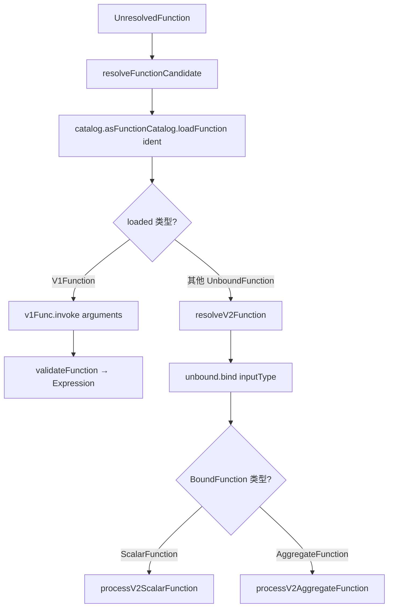

# Spark V2 路径调用 V1 UDF 报 `Cannot bind a V1 function` 的修复分析

## 一、问题背景

在 Spark 3.5 中，`V1Function` 的实现为：

```scala
case class V1Function(info: ExpressionInfo) extends UnboundFunction {
  override def bind(inputType: StructType): BoundFunction = {
    throw new UnsupportedOperationException("Cannot bind a V1 function.")
  }
  override def name(): String = info.getName
  override def description(): String = info.getUsage
}
```

这一实现存在以下问题：

1. **只携带元信息（`ExpressionInfo`），不持有可执行的 builder**。
2. 一旦 V2 函数解析路径走到 `UnboundFunction.bind(inputType)`，必然抛出 `UnsupportedOperationException("Cannot bind a V1 function.")`。
3. 用户在 V2 catalog 视角下调用持久化 V1 UDF（例如 Hive UDF、SQL 持久化 UDF）时，会直接失败。

错误信息在最新代码的错误码定义中仍可看到：

- 文件：`common/utils/src/main/resources/error/error-conditions.json`（第 11184 行附近）
- 内容：`"Cannot bind a V1 function."`（保留作为错误条件存档）

---

## 二、最新代码的修复结论

**最新 Spark 代码已经修复了该问题**。修复点不是简单地"让 V1 也支持 bind"，而是从两个方向重构：

1. 重新设计 [V1Function.scala](sql/catalyst/src/main/scala/org/apache/spark/sql/internal/connector/V1Function.scala)：让它**自带 `FunctionBuilder`，并暴露 V1 自己的 `invoke()` 方法**，绕过 V2 的 `bind/BoundFunction` 抽象。
2. 修改 [FunctionResolution.scala](sql/catalyst/src/main/scala/org/apache/spark/sql/catalyst/analysis/FunctionResolution.scala) 中的 V2 解析路径：在 `loadFunction(...)` 之后**先做类型分发**，V1 走 `invoke`，V2 才走 `bind`。

---

## 三、新版 `V1Function` 的关键变化

文件：`sql/catalyst/src/main/scala/org/apache/spark/sql/internal/connector/V1Function.scala`

```scala
class V1Function private (
    val info: ExpressionInfo,
    builderFactory: () => FunctionBuilder) extends UnboundFunction {

  // 懒加载：只在第一次 invoke 时才真正构建 builder（加载 JAR/类）
  private lazy val functionBuilder: FunctionBuilder = builderFactory()

  // V1 自己的调用入口：直接产出 Catalyst Expression
  def invoke(arguments: Seq[Expression]): Expression = functionBuilder(arguments)

  override def bind(inputType: StructType): BoundFunction = {
    // 防御性兜底：正常路径根本不应该调用到这里
    throw SparkException.internalError("V1Function.bind() should not be called")
  }

  override def name(): String = info.getName
  override def description(): String = info.getUsage
}

object V1Function {
  /** Metadata-only V1Function（DESCRIBE 用），调用 invoke 才会报错。 */
  private val metadataOnlyBuilder: FunctionBuilder = _ =>
    throw SparkException.internalError("Metadata-only V1Function should not be invoked")

  /** 持久化函数：lazy builder，DESCRIBE 不触发资源加载。 */
  def apply(info: ExpressionInfo, builderFactory: () => FunctionBuilder): V1Function =
    new V1Function(info, builderFactory)

  /** 内置 / 临时 / 已缓存函数：builder 已就绪，立即可用。 */
  def apply(info: ExpressionInfo, builder: FunctionBuilder): V1Function =
    new V1Function(info, () => builder)

  /** 仅供 DESCRIBE FUNCTION 使用，不持有真正可调用的 builder。 */
  def metadataOnly(info: ExpressionInfo): V1Function =
    new V1Function(info, () => metadataOnlyBuilder)
}
```

### 设计要点

| 维度 | Spark 3.5 旧实现 | 最新实现 |
|------|------------------|----------|
| 是否持有 builder | ❌ 仅 `ExpressionInfo` | ✅ `FunctionBuilder`，可执行 |
| V2 调用路径 | 走 `bind()` → 抛 `UnsupportedOperationException` | 走 `invoke(arguments)` → 直接产 `Expression` |
| 资源加载时机 | —— | **lazy val**，首次 `invoke` 时才加载 JAR/类 |
| `bind()` 行为 | 用户可见错误 `Cannot bind a V1 function.` | 内部错误 `V1Function.bind() should not be called`，正常路径不会触发 |
| DESCRIBE 场景 | OK | `metadataOnly` 工厂，避免触发资源加载 |

---

## 四、`FunctionResolution` 解析路径的配套修改

文件：`sql/catalyst/src/main/scala/org/apache/spark/sql/catalyst/analysis/FunctionResolution.scala`

关键代码（位于 `resolveFunctionCandidate`）：

```scala
val CatalogAndIdentifier(catalog, ident) =
  relationResolution.expandIdentifier(nameParts)
val loaded = catalog.asFunctionCatalog.loadFunction(ident)
Some(loaded match {
  case v1Func: V1Function =>
    // V1 路径：直接 invoke，跳过 V2 bind
    val func = v1Func.invoke(unresolvedFunc.arguments)
    validateFunction(func, unresolvedFunc.arguments.length, unresolvedFunc)
  case unboundV2Func =>
    // 真正的 V2 UnboundFunction：走原来的 bind 流程
    resolveV2Function(unboundV2Func, unresolvedFunc.arguments, unresolvedFunc)
})
```

### 流程图



### 关键点

- **类型分发只发生一次**：在 V2 解析入口处通过 `match` 把 V1/V2 分流，下游各自走自己的体系，互不污染。
- **V1 路径不再依赖 `bind`**：`invoke` 直接调用 `FunctionBuilder` 产生 Catalyst `Expression`，沿用 V1 既有的执行链路。
- **V2 路径维持原状**：真正的 V2 `UnboundFunction` 仍走 `resolveV2Function`，调用 `bind` 得到 `ScalarFunction` 或 `AggregateFunction`。

---

## 五、V2SessionCatalog 与 SessionCatalog 的配合

文件：`sql/core/src/main/scala/org/apache/spark/sql/execution/datasources/v2/V2SessionCatalog.scala`

```scala
override def loadFunction(ident: Identifier): UnboundFunction = {
  catalog.loadPersistentScalarFunction(ident.asFunctionIdentifier)
}
```

文件：`sql/catalyst/src/main/scala/org/apache/spark/sql/catalyst/catalog/SessionCatalog.scala`

```scala
/**
 * Returns V1Function with:
 *   - eager ExpressionInfo（用于 DESCRIBE，无需加载 JAR）
 *   - lazy FunctionBuilder（首次调用时才加载资源）
 */
def loadPersistentScalarFunction(name: FunctionIdentifier): V1Function = {
  // ...
  V1Function(cachedInfo, cachedBuilder)        // 已缓存：立即可用
  // 或
  V1Function(info, builderFactory)              // 未缓存：懒加载
}
```

`Analyzer.scala` 中 `DESCRIBE FUNCTION` 的入口：

```scala
ResolvedNonPersistentFunc(nameParts.head, V1Function.metadataOnly(info))
```

由此形成完整闭环：

| 入口 | 使用的 `V1Function` 形态 | 是否加载资源 |
|------|---------------------------|--------------|
| `DESCRIBE FUNCTION` | `metadataOnly(info)` | ❌ |
| 内置/临时/已缓存调用 | `V1Function(info, builder)` | 已就绪 |
| 持久化函数首次调用 | `V1Function(info, builderFactory)` + `lazy val` | ✅ 首次触发 |
| V2 catalog 调用 V1 UDF | 同上，由 `V2SessionCatalog.loadFunction` 返回 | ✅ 首次触发 |

---

## 六、新旧行为对比总结

| 场景 | Spark 3.5 行为 | 最新代码行为 |
|------|---------------|--------------|
| `DESCRIBE FUNCTION v1_udf` | OK，不加载资源 | OK，`metadataOnly`，不加载资源 |
| V2 路径调用 V1 UDF | ❌ `Cannot bind a V1 function` | ✅ 走 `invoke()`，懒加载后正常执行 |
| 真正的 V2 UDF | OK（`bind`） | OK（`resolveV2Function` → `bind`） |
| 多次调用同一持久化 UDF | —— | 资源只加载一次（`lazy val`） |

---

## 七、设计哲学小结

1. **统一抽象，分类调度**：`UnboundFunction` 作为 V1/V2 共同对外的接口，让 `FunctionCatalog.loadFunction` 不必返回不同类型；类型分发集中在解析层完成一次。
2. **不强行让 V1 适配 V2 协议**：V2 的 `bind/BoundFunction` 假设函数有明确的输入/输出类型签名，V1 UDF（尤其是 Hive UDF）无法满足。最新代码没有强行让 V1 实现 `bind`，而是让 V1 沿用自己的 `FunctionBuilder` 体系。
3. **两阶段懒加载**：保留 V1 原有"DESCRIBE 不加载资源、调用时才加载资源"的语义，避免性能回退。
4. **`bind()` 作为契约级断言**：保留 `bind` 但只抛 `internalError`，作为防御性兜底——一旦触发即代表上游分发逻辑有 bug，便于排查。
5. **错误码档案保留**：`Cannot bind a V1 function.` 仍保留在 `error-conditions.json` 中作为历史错误码档案，但正常解析路径不再产生该错误。

---

## 八、相关文件索引

| 文件 | 角色 |
|------|------|
| `sql/catalyst/src/main/scala/org/apache/spark/sql/internal/connector/V1Function.scala` | V1Function 重新设计：lazy builder + invoke |
| `sql/catalyst/src/main/scala/org/apache/spark/sql/catalyst/analysis/FunctionResolution.scala` | V2 解析路径上对 `V1Function` 类型短路 |
| `sql/catalyst/src/main/scala/org/apache/spark/sql/catalyst/analysis/Analyzer.scala` | `DESCRIBE FUNCTION` 使用 `V1Function.metadataOnly` |
| `sql/catalyst/src/main/scala/org/apache/spark/sql/catalyst/catalog/SessionCatalog.scala` | `loadPersistentScalarFunction` 构造带 builder 的 V1Function |
| `sql/core/src/main/scala/org/apache/spark/sql/execution/datasources/v2/V2SessionCatalog.scala` | V2 SessionCatalog 通过 `loadFunction` 暴露 V1Function |
| `sql/core/src/main/scala/org/apache/spark/sql/catalyst/analysis/ResolveSessionCatalog.scala` | DESCRIBE FUNCTION 命令处理时识别 V1Function |
| `sql/core/src/main/scala/org/apache/spark/sql/classic/Catalog.scala` | Catalog API 中读取 V1Function 元信息 |
| `common/utils/src/main/resources/error/error-conditions.json` | 错误码档案，保留 `Cannot bind a V1 function.` 历史记录 |

