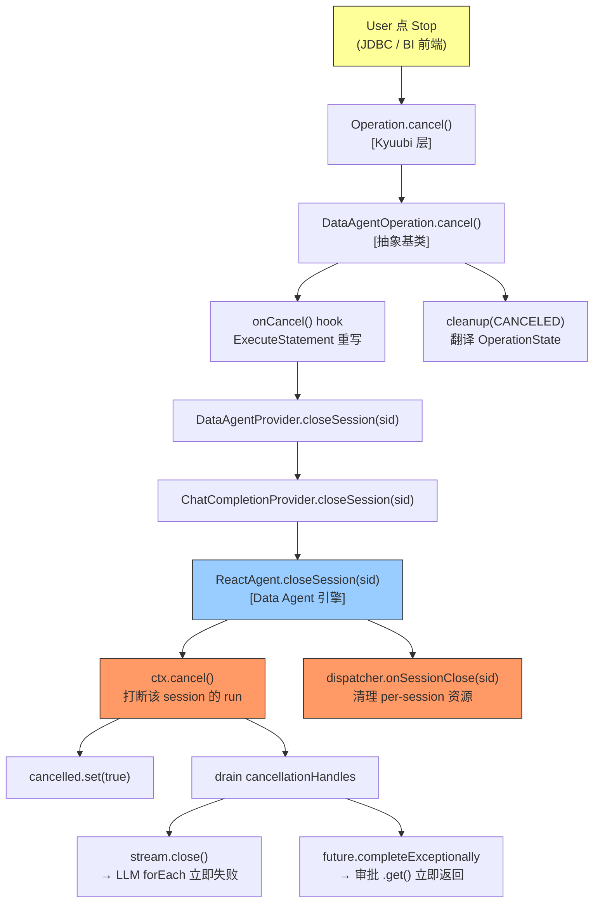
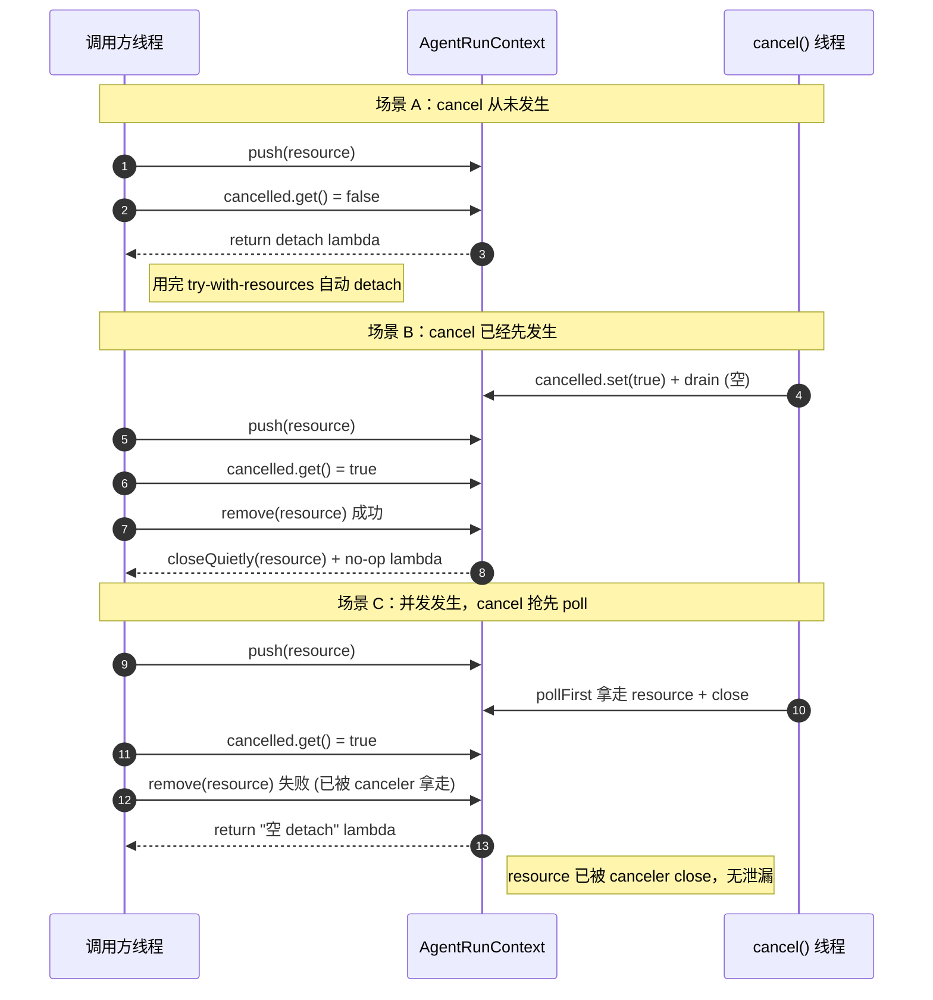
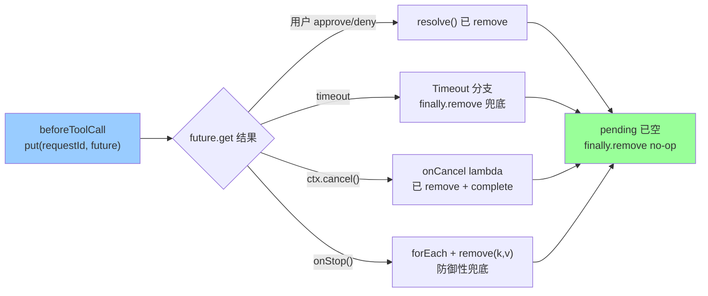
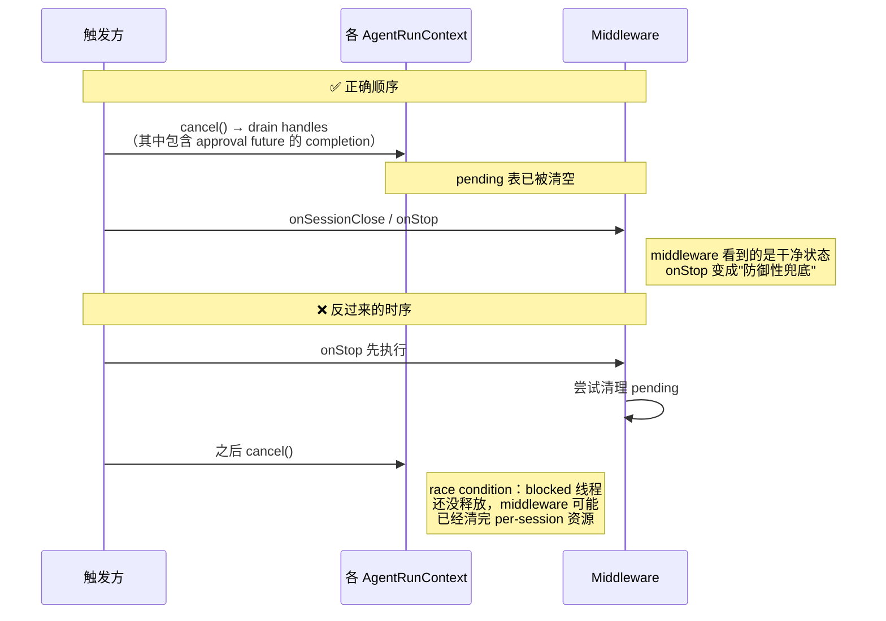

# Data Agent Stop 实现详解

> 面向读者：Kyuubi Data Agent 引擎维护者、Code Reviewer、排障 SRE。
>
> 本文的所有代码片段均对齐当前主分支（截至本文生成时刻的最新代码）。

---

## 1. 场景与需求

用户在 BI 前端触发一次 Agent 对话后（比如"帮我查一下昨天下单最多的 top 10 用户"），Agent 会：

1. 调 LLM 生成推理
2. 也许要人审批高危工具
3. 调工具、把结果喂回 LLM
4. 循环直到给出答案

这个过程可能持续数十秒。如果用户中途改变主意点了 **Stop 按钮**，我们需要——

> **让 agent 线程"立即"停下来，释放 LLM Token、DB 连接、审批线程、临时文件；操作状态置为 `CANCELED`；未来的错误堆栈仍可追查。**

"立即"具体包括三个不同的阻塞形态，每种都要能被打断：

| 阻塞位置                            | 阻塞形态                              | 打断途径                            |
| ----------------------------------- | ------------------------------------- | ----------------------------------- |
| LLM stream 传输中                   | 卡在 SSE 的 `forEach` 里读 chunk      | 关闭底层 HTTP 流 → `forEach` 抛异常 |
| 等待人工审批                        | 卡在 `CompletableFuture.get(timeout)` | complete 该 future 让 `.get()` 返回 |
| 循环边界（工具执行前/后、迭代边界） | 主线程在跑同步 Java 代码              | 检查 flag，主动退出                 |

---

## 2. 全链路总览



这条链的**方向感**：从最外层的 JDBC 一路穿过 Kyuubi Operation 抽象层、DataAgentProvider 接口层，最终落到引擎内部的 `ReactAgent.closeSession`。**每一层只做一件事**：

| 层                                    | 职责                                  | 关键决定                                     |
| ------------------------------------- | ------------------------------------- | -------------------------------------------- |
| `Operation.cancel`                    | 翻译 JDBC Cancel → OperationState     | 见到 CANCEL 请求就转 CANCELED                |
| `DataAgentOperation.cancel`           | 提供 `onCancel` hook 供子类扩展       | try/catch 保护，hook 失败不阻塞状态迁移      |
| `ExecuteStatement.onCancel`           | 桥接 Kyuubi Session 与 Engine Session | 把 `session.handle.identifier` 传给 provider |
| `DataAgentProvider.closeSession`      | 引擎无关的抽象接口                    | default 空实现，非 chat 后端无需 override    |
| `ChatCompletionProvider.closeSession` | ChatCompletion 引擎的实际转发         | 委托给内嵌的 ReactAgent                      |
| `ReactAgent.closeSession`             | 双信号入口                            | ctx.cancel + dispatcher.onSessionClose       |
| `AgentRunContext.cancel`              | 真正的打断执行者                      | flip flag + drain handles                    |

---

## 3. 核心抽象：`AgentRunContext.onCancel / cancel`

这是整个方案的**理论支柱**。所有需要"在 cancel 时被打断"的资源，都在这里注册。

### 3.1 数据结构

```java
private final AtomicBoolean cancelled = new AtomicBoolean(false);
private final ConcurrentLinkedDeque<AutoCloseable> cancellationHandles =
    new ConcurrentLinkedDeque<>();
```

- **`cancelled`**：一次性状态位，通过 CAS 保证 `cancel()` 幂等。
- **`cancellationHandles`**：一个 LIFO 的 Deque，注册顺序**后进先出**释放——因为通常内层作用域（如 `LlmStreamClient` 的 stream）应该先于外层作用域（如整个 run）关闭。

### 3.2 `onCancel(resource)` 的注册契约

```java
public AutoCloseable onCancel(AutoCloseable resource) {
  cancellationHandles.push(resource);
  if (cancelled.get() && cancellationHandles.remove(resource)) {
    closeQuietly(resource);
    return () -> {};
  }
  return () -> cancellationHandles.remove(resource);
}
```

**Push-then-recheck 语义**（一次 CAS 处理三种时序竞争）：



三种场景下都能保证：**resource 恰好被 close 一次**、**detach lambda 永远安全**。

### 3.3 `cancel()` 的执行契约

```java
public void cancel() {
  if (!cancelled.compareAndSet(false, true)) return;   // 幂等
  AutoCloseable h;
  while ((h = cancellationHandles.pollFirst()) != null) {
    closeQuietly(h);                                    // 逐个 close，异常吞掉不阻塞后续
  }
}
```

要点：

- **CAS 幂等**：多次调用 `cancel()` 也只走一次 drain。
- **LIFO 顺序**：`pollFirst` 从队头拿，即最后 push 的先出。
- **异常隔离**：`closeQuietly` 内部 catch 掉所有异常并 warn 日志，一个 handle close 失败不影响其他 handle。

---

## 4. 三个阻塞场景的实际打断

### 4.1 LLM Stream —— IO 层抢占

```java
// LlmStreamClient.stream()
try (StreamResponse<ChatCompletionChunk> stream =
        client.chat().completions().createStreaming(paramsBuilder.build());
    AutoCloseable ignored = ctx.onCancel(stream)) {
  stream.stream().forEach(chunk -> consumeChunk(ctx, chunk, acc));
} catch (AgentCancelledException e) {
  throw e;                             // 早 rethrow，保留原始堆栈
} catch (Exception e) {
  if (ctx.isCancelled()) {
    throw new AgentCancelledException("LLM stream cancelled");
  }
  throw ...;                           // 其他错误照常抛
}
```

时序：

```mermaid
sequenceDiagram
    participant U as User
    participant Op as Operation.cancel
    participant Ctx as AgentRunContext
    participant Stream as SSE Stream
    participant Loop as forEach

    U->>Op: 点 Stop
    Op->>Ctx: ctx.cancel()
    Ctx->>Stream: stream.close()  ←（AutoCloseable 通过 handle 触发）
    Stream-->>Loop: onNext 抛 IOException
    Loop-->>Op: 异常向上冒泡，被 catch(Exception) 翻译成 AgentCancelledException
```

**几微秒**内即可打断——因为不需要等待任何轮询，close HTTP 连接会同步唤醒读线程。

### 4.2 人工审批 —— 回调层抢占

```java
// ApprovalMiddleware.beforeToolCall()
CompletableFuture<Boolean> future = new CompletableFuture<>();
pending.put(requestId, future);
ctx.emit(new ApprovalRequest(...));

try (AutoCloseable ignored =
    ctx.onCancel(() -> {
      if (pending.remove(requestId, future)) {
        future.completeExceptionally(new AgentCancelledException("Session closed"));
      }
    })) {
  boolean approved = future.get(timeoutSeconds, TimeUnit.SECONDS);  // ← 阻塞点
  ...
}
```

`future.get(...)` 阻塞在 park 状态，`ctx.cancel()` 会 fire 上面注册的 lambda，把 future complete 掉，`.get()` 立即抛 `ExecutionException(AgentCancelledException)`，被下面的 catch 分支翻译成 `Decision.abort`。

审批的**三出口**（这也是评审重点关注的部分）：



关键的**"remove-then-complete"契约**：任何路径都必须**先 remove 再 complete**，保证 `resolve()` 或其他并发路径的 `remove(key, future)` 返回 `false` 时不会 double-complete。

### 4.3 循环边界 —— Flag 层协作

有些点没有可 close 的 IO 资源可以抢占，只能靠"轮询检查 flag"：

```java
// ReactAgent.run() 主循环开头
for (int step = 1; step <= maxIterations; step++) {
  if (checkCancelled(ctx)) return;
  ...
}

// executeToolCalls() 的 join 循环
for (int i = 0; i < approved.size(); i++) {
  if (ctx.isCancelled()) {
    // 保留 tool_result 补齐（assistant/tool_result 配对不能断），但短路后续 futures.join()
    memory.addToolResult(entry.fnCall.id(), "Tool call cancelled");
    ctx.emit(new ToolResult(...));
    continue;
  }
  String raw = futures.get(i).join();
  ...
}
```

只在**必要的两处**保留 checkpoint：

1. **迭代边界**：`for step` 循环开头（避免开启新一轮 LLM 调用）
2. **工具 join 循环**：`.join()` 是 blocking 的，只能靠 flag 短路

其他位置（LLM 调用返回后、执行工具前）不加 checkpoint——因为**cancel 已经通过 IO 层抢占传播过来了**，再检查是冗余。

---

## 5. 主循环的异常处理契约

```java
try {
  for (int step = 1; step <= maxIterations; step++) { ... }
} catch (AgentCancelledException e) {
  emitCancelled(ctx);                                    // 正常取消路径
} catch (Exception e) {
  if (ctx.isCancelled()) {
    LOG.debug("Agent cancelled during exception path", e);  // 保留真实堆栈
    emitCancelled(ctx);                                    // 防御性取消路径
  } else {
    LOG.error("Agent run failed", e);
    ctx.emit(new AgentError(...));
    emitFinish(ctx);                                       // 真错误路径
  }
} finally {
  if (sessionId != null) activeRuns.remove(sessionId, ctx);
  dispatcher.onAgentFinish(ctx);
}
```

**为什么两个 catch 分工设计**：

| catch                              | 语义                     | 何时触发                                                     |
| ---------------------------------- | ------------------------ | ------------------------------------------------------------ |
| `AgentCancelledException`          | 语义清晰的"内部取消信号" | LlmStreamClient 已翻译好；ApprovalMiddleware complete future 后被 unwrap |
| `Exception` + `ctx.isCancelled()`  | 兜底                     | SDK 内部把 close stream 翻成 SocketException/IllegalStateException，或未来 SDK 换实现 |
| `Exception` + `!ctx.isCancelled()` | 真实错误                 | LLM 拒绝、工具抛异常、模型 API 5xx 等                        |

`LOG.debug` 的作用是——**罕见 race 场景（真实异常 + 同时被取消）下，让根因堆栈至少能出现在 debug 日志里**，避免"用户报错但排障时无线索"。

---

## 6. 顺序契约：`closeSession` vs `stop`

`ReactAgent` 对外暴露两个入口，看似相似但语义不同：

```java
// closeSession：per-session（用户点 Stop 走这条）
public void closeSession(String sessionId) {
  if (sessionId != null) {
    AgentRunContext ctx = activeRuns.get(sessionId);
    if (ctx != null) ctx.cancel();
  }
  dispatcher.onSessionClose(sessionId);
}

// stop：engine-wide（引擎关闭走这条）
public void stop() {
  activeRuns.values().forEach(AgentRunContext::cancel);
  dispatcher.onStop();
}
```

**共同的顺序契约**：先 cancel per-run，后通知 middleware。这个顺序不能反：



---

## 7. LangChain / langchain4j 对比

| 维度            | LangChain (Python)                      | langchain4j                                             | **Kyuubi Data Agent**             |
| --------------- | --------------------------------------- | ------------------------------------------------------- | --------------------------------- |
| 主循环取消形态  | asyncio 抢占（Cancelled 从 await 冒泡） | 主循环**不做**取消检查                                  | 协作式 checkpoint + IO 抢占       |
| Cancel 语言底座 | `task.cancel()`                         | `Thread.interrupt()`（几乎不用）                        | `AtomicBoolean` + `AutoCloseable` |
| 审批            | `interrupt()` + checkpointer            | 挂起/恢复（SuspendedResponse）+ 阻塞（PendingResponse） | 阻塞 future + ctx.onCancel 唤醒   |
| checkpoint 个数 | 0（asyncio 自动）                       | 0                                                       | 2（迭代边界 + 工具 join）         |
| 复杂度成本      | 低（语言原生）                          | 低（把问题推给挂起-恢复架构）                           | 中（Java 无抢占，必须手写协作式） |

结论：**Java 生态下手写"协作式取消 + IO 抢占"的组合是最经济的方案**——没有 asyncio 的语言福利，也没有必要为一个 cancel 引入 Reactor / Loom；当前实现在这个约束下已经是接近最优的形态。

---

## 8. 关键防御性代码清单

以下代码单看"什么都没做"，但删掉就是 bug——都是 review 过程中挖出并加了注释锁定意图的：

| 位置                          | 代码                                           | 存在意义                                                     |
| ----------------------------- | ---------------------------------------------- | ------------------------------------------------------------ |
| `LlmStreamClient`             | `catch (AgentCancelledException) { throw e; }` | 挡在 `catch(Exception)` 前面，防止原异常被 rethrow-as-new 覆盖 |
| `ApprovalMiddleware.finally`  | `pending.remove(requestId)`                    | Timeout / unexpected-exception 兜底；其他三条出口自己已 remove |
| `ReactAgent.executeToolCalls` | 取消后仍写入 `tool_result`                     | LLM API 要求 assistant + tool_result 严格配对，缺一就 400    |
| `AgentRunContext.onCancel`    | push-then-recheck 的 recheck                   | 处理 push 与 cancel 并发的 race                              |
| `ReactAgent.catch(Exception)` | `LOG.debug` + emitCancelled                    | cancel 与真实异常同时发生时保留根因堆栈                      |
| `ApprovalMiddleware.onStop`   | forEach + `remove(key, future)`                | ctx.cancel 已经清空 pending 后的**防御性兜底**               |

---

## 9. 单元测试映射

关键契约都有对应 UT 钉住（截至本文生成时刻共 20 个）：

| 契约                                   | UT                                                           |
| -------------------------------------- | ------------------------------------------------------------ |
| `onCancel` 后立即 cancel 只 close 一次 | `AgentRunContextCancellationTest.testCancelBeforeRegisterClosesResourceEagerly` |
| LIFO 顺序                              | `testMultipleHandlesClosedInLifoOrder`                       |
| Cancel 幂等                            | `testCancelIsIdempotent`                                     |
| detach lambda 幂等                     | `testHandleAutoDetachesOnClose`                              |
| ReactAgent 主循环响应 cancel           | `ReactAgentCancellationTest.testCancelDuringStreaming`       |
| Approval 三出口 + Race                 | `ApprovalMiddlewareTest` × 10                                |

---

## 10. 一句话总结

> **Kyuubi Data Agent 的 Stop 实现，把 Java 缺失的"抢占式取消"用「IO 关闭 + 回调唤醒 + Flag 轮询」三件套模拟出来；`AgentRunContext.onCancel/cancel` 是唯一的注册-触发对，其他所有中间件、Client、主循环都只是订阅者。**

从用户点 Stop 到 agent 线程真正停下，端到端的 P99 延迟应该在**单个 chunk 传输时间以内**（对 LLM 阶段）、**单个工具 join 完成后**（对工具阶段）、**立即**（对审批阶段）。